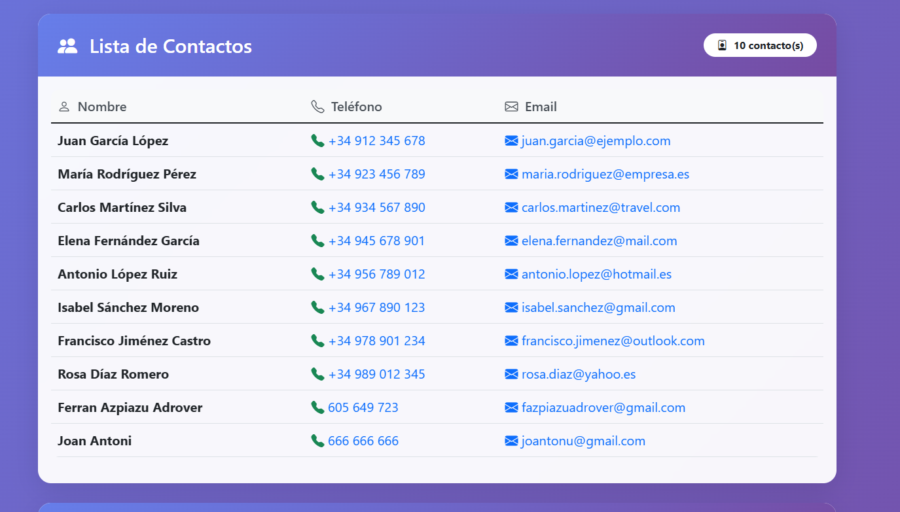
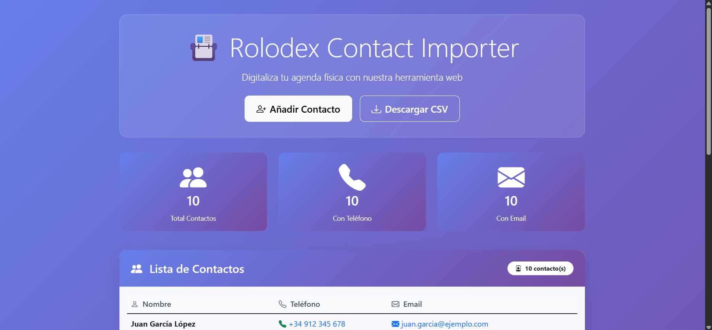

# 📋 Rolodex Contact Importer

> A simple and efficient solution for digitizing physical Rolodex cards into digital format.

## Overview

**Rolodex Contact Importer** is a two-part application for digitizing contacts from physical Rolodex cards into a modern CSV database. It provides both a command-line interface (CLI) and a responsive web application.

- **CLI Tool**: Interactive command-line contact entry
- **Web App**: Modern web interface with responsive design  
- **Storage**: Centralized CSV file (`writable/contacts.csv`)

---

## ✨ Features

### **CLI**
- Interactive command-line contact input
- Real-time CSV file updates
- Input validation (Name, Email, Phone, Postal Code)
- Simple and intuitive workflow

### **Web**
- Modern responsive design (Bootstrap 5)
- Contact management interface
- Real-time CSV synchronization
- Download CSV functionality
- Contact statistics
- Mobile-friendly layout

---

## 📸 Screenshots

### Web Interface - Contacts List
  
*View all digitized contacts in a clean, organized table format*

### Web Interface - Success Message
  
*Confirmation message after successfully adding a new contact*

---

## 🚀 Quick Start

### Prerequisites
- PHP 7.4 or higher
- Composer

### Installation

1. **Install dependencies**:
```bash
composer install
```

2. **Run the CLI tool**:
```bash
php contact-importer.php
```

3. **Start the web server**:
```bash
php -S localhost:8080
```

4. **Access the web interface**:
Open your browser and go to `http://localhost:8080`

---

## 📝 Usage

### CLI
```bash
php contact-importer.php
```

Follow the prompts to enter contact information:
- **Name** (required)
- **Email** (validated)
- **Phone** (optional)
- **Postal Code** (optional)

### Web
1. Navigate to `http://localhost:8080`
2. Fill in the contact form
3. Click "Add Contact" to save
4. View all contacts in the list
5. Download contacts as CSV

---

## 💾 Data Storage

Contacts are stored in `writable/contacts.csv` and synchronized in real-time across both CLI and Web interfaces.

---

## 📂 Project Structure

```
.
├── contact-importer.php    # CLI Tool
├── index.php               # Web Application
├── composer.json           # Dependencies
├── app/
│   ├── Config/            # Configuration
│   ├── Controllers/       # Application logic
│   ├── Views/            # HTML templates
│   └── images/           # Screenshots
├── writable/
│   └── contacts.csv      # Contact database
└── public/
    └── index.php         # Web entry point
```

---

**Status**: ✅ Production Ready | **Version**: 1.0
